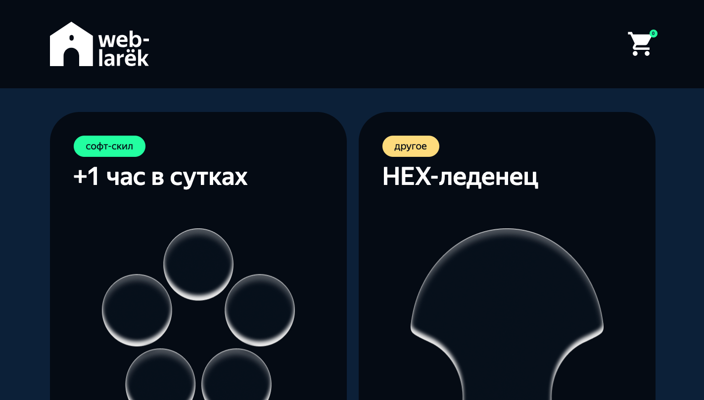

# WebLarek - Интернет-магазин

[](https://www.typescriptlang.org/)
[](https://webpack.js.org/)
[](https://sass-lang.com/)



## 📋 Описание проекта

**WebLarek** - это современный интернет-магазин, реализованный как одностраничное веб-приложение (SPA). Проект представляет собой полнофункциональную платформу для покупки товаров с возможностью просмотра каталога, добавления товаров в корзину, оформления заказа и выбора способа оплаты.

### 🎯 Основные возможности

- **Каталог товаров** - отображение товаров с изображениями, ценами и описаниями
- **Корзина покупок** - добавление/удаление товаров, подсчет общей стоимости
- **Модальные окна** - детальный просмотр товаров, корзина, формы заказа
- **Формы заказа** - ввод адреса доставки, способа оплаты, контактных данных
- **Валидация форм** - проверка корректности введенных данных
- **Адаптивный дизайн** - корректное отображение на различных устройствах
- **API интеграция** - взаимодействие с backend сервером для получения данных и отправки заказов

## 🛠 Технологический стек

### Основные технологии
- **TypeScript** (5.0.4) - типизированный JavaScript
- **Webpack** (5.81.0) - сборщик модулей
- **SCSS** (1.62.1) - препроцессор CSS
- **HTML5** - разметка страниц

### Инструменты разработки
- **ESLint** (8.39.0) - линтер кода
- **Prettier** (2.8.8) - форматирование кода
- **Babel** (7.21.5) - транспиляция JavaScript
- **PostCSS** (8.4.23) - обработка CSS
- **Autoprefixer** (10.4.14) - автоматическое добавление префиксов

### Дополнительные библиотеки
- **gh-pages** (5.0.0) - деплой на GitHub Pages
- **dotenv** (16.3.1) - управление переменными окружения
- **Terser** (5.3.10) - минификация кода

## 📁 Структура проекта

```
web-larek-frontend/
├── src/                          # Исходные файлы проекта
│   ├── components/               # Компоненты приложения
│   │   ├── base/                # Базовые классы
│   │   │   ├── api.ts           # API клиент
│   │   │   ├── Components.ts    # Базовый класс компонента
│   │   │   └── events.ts        # Система событий
│   │   ├── model/               # Модели данных
│   │   │   ├── AppApi.ts        # API для работы с сервером
│   │   │   ├── BasketData.ts    # Данные корзины
│   │   │   ├── ItemData.ts      # Данные товаров
│   │   │   └── UserData.ts      # Данные пользователя
│   │   └── view/                # Представления (View)
│   │       ├── Basket.ts        # Компонент корзины
│   │       ├── Form.ts          # Компоненты форм
│   │       ├── Item.ts          # Компоненты товаров
│   │       ├── Modal.ts         # Модальные окна
│   │       ├── Page.ts          # Главная страница
│   │       └── Success.ts       # Страница успешного заказа
│   ├── images/                  # Изображения
│   ├── pages/                   # HTML страницы
│   │   └── index.html           # Главная страница
│   ├── scss/                    # Стили
│   │   ├── _variables.scss      # Переменные
│   │   ├── mixins/              # Миксины
│   │   └── styles.scss          # Основные стили
│   ├── types/                   # TypeScript типы
│   │   └── index.ts             # Интерфейсы и типы
│   ├── utils/                   # Утилиты
│   │   ├── constants.ts         # Константы
│   │   └── utils.ts             # Вспомогательные функции
│   ├── vendor/                  # Внешние библиотеки
│   └── index.ts                 # Точка входа приложения
├── public/                      # Публичные файлы
├── dist/                        # Собранный проект
├── package.json                 # Зависимости и скрипты
├── webpack.config.js            # Конфигурация Webpack
├── tsconfig.json                # Конфигурация TypeScript
└── README.md                    # Документация
```

## 🚀 Установка и запуск

### Предварительные требования
- Node.js (версия 14 или выше)
- npm или yarn

### Установка зависимостей

```bash
# Используя npm
npm install

# Или используя yarn
yarn
```

### Запуск в режиме разработки

```bash
# Используя npm
npm run start

# Или используя yarn
yarn start
```

Приложение будет доступно по адресу: `http://localhost:8080`

### Сборка для продакшена

```bash
# Используя npm
npm run build

# Или используя yarn
yarn build
```

### Дополнительные команды

```bash
# Сборка в режиме разработки
npm run build:dev

# Сборка в режиме продакшена
npm run build:prod

# Режим наблюдения за изменениями
npm run watch

# Проверка кода линтером
npm run lint

# Автоматическое исправление ошибок линтера
npm run lint:fix

# Форматирование кода
npm run format

# Деплой на GitHub Pages
npm run deploy
```

## 🌐 Деплой

Проект размещен на GitHub Pages: [https://maksim533.github.io/web-larek-frontend/](https://maksim533.github.io/web-larek-frontend/)

## 🏗 Архитектура приложения

Архитектура приложения реализована на **Model-View-Presenter (MVP)**, которая обеспечивает разделение слоев на:

- **Model** - обеспечивает хранение и обработку данных с сервера или пользователя
- **View** - обеспечивает отображение данных в интерфейсе
- **Presenter** - выступает в качестве посредником между Model и View

### Схема архитектуры

```
┌─────────────────┐    ┌─────────────────┐    ┌─────────────────┐
│      View       │    │   Presenter     │    │      Model      │
│                 │    │                 │    │                 │
│ - Page          │◄──►│ - EventEmitter  │◄──►│ - ItemData      │
│ - Modal         │    │ - Event Handlers│    │ - UserData      │
│ - Basket        │    │                 │    │ - BasketData    │
│ - Form          │    │                 │    │ - AppApi        │
└─────────────────┘    └─────────────────┘    └─────────────────┘
```

## 📊 Интерфейсы данных

### Товар

```typescript
interface IItem {
  id: string
  tag: string
  title: string
  description: string
  image: string
  price: number | null
}
```

### Пользователь

```typescript
interface IUser {
  address: string
  number: number
  payment: string
  email: string
}
```

### Дополнительные типы

```typescript
// Данные для заполнения формы адреса и типа оплаты
type IUserAddressAndPayment = Pick<IUser, 'address' | 'payment'>

// Данные для заполнения номера и эл. почты
type IUserNumberAndEmail = Pick<IUser, 'number' | 'email'>
```

## 🔧 Базовые классы

### Component

Абстрактный класс предназначен для взаимодействия с элементами страницы

**Методы класса:**
- `toggleClass(element: HTMLElement, className: string, force?: boolean)` - поменять класс
- `setText(element: HTMLElement, value: unknown)` - вставить текст
- `setDisabled(element: HTMLElement, state: boolean)` - Сменить статус блокировки
- `setHidden(element: HTMLElement)` - скрыть элемент
- `setVisible(element: HTMLElement)` - показать элемент
- `setImage(element: HTMLImageElement, src: string, alt?: string)` - установить изображение с альтернативным текстом
- `render(data?: Partial<T>): HTMLElement` - вернуть корневой DOM-элемент

### Api

Класс Api отвечает за отправлени и получение запросов от сервера

**Поля класса:**
- `baseUrl: string` - хранит url
- `options: RequestInit` - хранит опции для запроса на сервер

**Методы класса:**
- `handleResponse(response: Response): Promise<'object'>` - обрабатывает ответ от сервера
- `get(uri: string)` - получает ответ от сервера
- `post(uri: string, data: object, method: ApiPostMethods = 'POST')` - отправляет запрос на сервер

### EventEmitter

Класс EventEmitter который соответствует интерфейсу IEvents, отвечает за обработку событий.

**Поля класса:**
- `_events: Map<EventName,Set<'Subscriber'>>` - отвечает за хранение колекции событий

**Методы класса:**
- `on<T extends object>(eventName: EventName, callback: (event: T) => void)` - устанавливает обработчик на событие
- `off(eventName: EventName, callback: Subscriber)` - снимает обработчик с события
- `emit<T extends object>(eventName: string, data?: T)` - Инициирует событие с данными
- `onAll(callback: (event: EmitterEvent) => void)` - слушает все события
- `offAll()` - сбрасывает все обработчики
- `trigger<T extends object>(eventName: string, context?: Partial<T>)` - делает коллбек тригер, генерирующий событие при вызове

## 📦 Классы данных

### Класс ItemData

Класс отвечает за хранение и обработку данных с сервера

**Поля класса:**
- `items: IItem[]` - поле для сохранения массива карточек
- `events: IEvents` - поле для сохранения класса events
- `preview: IItem` - поле для сохранения одной карточки

**Методы класса:**
- `setAllItems(Items: IItem[]):void` - cохраняет массив карточек
- `getItem(ItemId: string): IItem` - получает карточку по её id
- `getAllItem():IItem[]` - получает массив карточек
- `setPreview(item: IItem)` - сохраняет одну карточку для показа

### Класс UserData

Класс отвечает за хранение и обработку данных от пользователя

**Поля класса:**
- `order: IUser` - сохраняет данные пользователя
- `formErrors: FormErrors` - поле для ошибок
- `events: IEvents` - поле для сохранения класса events

**Методы класса:**
- `setOrderField(field: keyof IUser, value: string): void` - сохраняет данные пользователя
- `validityOrder()` - валидирует данные пользователя

### Класс BasketData

Класс отвечает за хранение и обработку данных для корзины от пользователя

**Поля класса:**
- `items: IItem[]` - сохраняет карточки в корзине
- `events: IEvents` - поле для сохранения класса events

**Методы класса:**
- `setAllItems(items: IItem[])` - сохраняет массив карточек
- `getFullPrice():number` - считает и возвращает сумму всех товаров в корзине
- `getCounter():number` - возвращает количество товаров в корзине
- `addItem(item: IItem):void` - добавляет карточку в корзину
- `deleteItem(itemId: string): void` - удаляет товар с корзины
- `getBasketItems(item: IItem)` - проверяет есть ли карточка в корзине
- `deleteAllItem():void` - удаляет все карточки с корзины
- `getAllItems():IItem[]` - метод получает массив всех товаров с корзины
- `getAllIdItems(items: IItem[]):[]` - метод получает id карточек

## 🎨 Классы представления

### Класс Modal

Класс предназначен для отображения попапа на странице

**Поля класса:**
- `closeButton: HTMLButtonElement` - кнопка закрытия
- `_content: HTMLElement` - контент попапа

**Методы класса:**
- `set content(value: HTMLElement)` - сохраняет контент попапа
- `open():void` - метод для открытия попапа
- `close():void` - метод для закрытия попапа
- `render():HTMLElement` - метод возвращает попап

### Класс Item

Класс наследуется от Component, класс предназначен для отображения товаров на странице

**Поля класса:**
- `itemTitle:HTMLElement` - название товара
- `itemPrice:HTMLElement` - цена товара

**Методы класса:**
- `set id(value: string)` - сеттер сохраняет id товара
- `set title(value: string)` - сеттер сохраняет название товара
- `setPrice(price: number | null):string` - метод переводит цену из числа в строку

### Класс ItemElement

Класс наследуется от Item, предназначен для отображение товара на странице

**Поля класса:**
- `itemImage:HTMLImageElement` - изображение карточки
- `itemCategory:HTMLElement` - категория товара
- `button: HTMLButtonElement` - карточка товара
- `itemCategoryColor: Record<string, string>` - обьект для стилизации категории товара

**Сеттеры класса:**
- `set image(value: string)` - подставляет изображение товара
- `set category(value: string)` - подставляет категорию товара

### Класс BasketItem

Класс наследуется от Item, предназначен для отображения товара в корзине

**Поля класса:**
- `_index:HTMLElement` - индекс элемента
- `buttonDelete:HTMLButtonElement` - кнопка удаления товара

**Сеттеры класса:**
- `set index(value: string)` - подставляет index товара в корзине

### Класс ItemPreview

Класс наследуется от Item, предназначен для отображения полного описания товара

**Поля класса:**
- `itemDescription:HTMLElement` - описание товара
- `_itemButton` - кнопка купить

**Методы класса:**
- `set itemButton(value: boolean)` - подставляет текст на кнопку добавление/удаления корзины
- `set description(value: string)` - подставляет описание карточки

### Класс Basket

Класс наследуется от Component, предназначен для отображения корзины

**Поля класса:**
- `basketList:HTMLElement` - список товаров
- `bascetButton:HTMLButtonElement` - кнопка оформления
- `basketPrice:HTMLElement` - общая сумма

**Сеттеры класса:**
- `set fullPrice(value: number)` - сеттер сохраняет и отображает полную сумму товара в корзине
- `set items(items: HTMLElement[])` - сеттер сохраняет и отображает товар в корзине

### Класс Page

Класс наследуется от Component, предназначен для отображения корзины в шапке

**Поля класса:**
- `headerBascetButton:HTMLButtonElement` - кнопка корзины
- `headerBascetCounter:HTMLElement` - количество товара в корзине
- `itemContainer: HTMLElement` - контейнер для товара
- `wrapper: HTMLElement`

**Методы класса:**
- `set itemList(items: HTMLElement[])` - сеттер сохраняет и отображает товар на странице
- `set counter(value: number)` - сеттер сохраняет значение и отображает количество товара в корзине
- `set locked(value: boolean)` - Метод для блокировки/разблокировки прокрутки страницы при открытии модального окна

### Класс Form

Класс предназначен для отображения форм

**Поля класса:**
- `buttonSubmit: HTMLButtonElement` - кнопка продолжить/оплатить
- `_errors: HTMLElement` - текст ошибки

**Методы класса:**
- `onInputChange(field: keyof T, value: string)` - создает событие
- `set isValid(valid: boolean):void` - сеттер блокирует кнопку при невалидных значения
- `set errors(value: string)` - сеттер отображает текст ошибки

### Класс FormOrder

Класс наследуется от Form, предназначен для отображение формы адреса и типа оплаты

**Поля класса:**
- `_buttons:HTMLButtonElement[]` - кнопки типа оплаты

**Сеттеры класса:**
- `set payment(button: string):void` - сеттер добавляет обводку к выбранной кнопке оплаты
- `set address(value: string)` - сеттер сохраняет значение поля `address`

### Класс FormContacts

Класс наследуется от Form, предназначен для отображения формы с номером и эл. почтой

**Сеттеры класса:**
- `set phone(value: string)` - сеттер сохраняет значение поля `phone`
- `set email(value: string)` - сеттер сохраняет значение поля `email`

### Класс Success

Класс наследуется от Component, предназначен для вывода модального окна с успешным статусом

**Поля класса:**
- `close: HTMLElement` - кнопка `за новыми покупками`
- `_total: HTMLElement` - выводит полную стоимость покупки

**Сеттеры класса:**
- `set total(value: number)` - сеттер отображает полную стоимость покупки

## 🌐 Слой коммуникации

### Класс AppApi

Класс наследуется от Api, предназначен для реализации взаимодействия с бекендом сервера

**Поля Класса:**
- `cdn:string` - содержит url куда отпраляется запрос

**Методы класса:**
- `getAllItem():Promise` - получает список товаров
- `getItemId(itemId: string):Promise` - получает товар по id
- `postItem(data):Promise` - отправляет данные на сервер и возвращает результат

## 🎨 Стилизация

Проект использует **SCSS** для стилизации с модульной архитектурой:

- **Переменные** (`_variables.scss`) - цвета, размеры, шрифты
- **Миксины** (`mixins/`) - переиспользуемые стили
- **Компоненты** (`common.blocks/`) - стили для конкретных компонентов
- **Основные стили** (`styles.scss`) - глобальные стили

### Поддерживаемые браузеры

- Chrome (последние версии)
- Firefox (последние версии)
- Safari (последние версии)
- Edge (последние версии)

## 👨‍💻 Автор

**Максим Котюков** - [GitHub](https://github.com/maksim533)

## 🤝 Вклад в проект

1. Форкните проект
2. Создайте ветку для новой функции (`git checkout -b feature/AmazingFeature`)
3. Зафиксируйте изменения (`git commit -m 'Add some AmazingFeature'`)
4. Отправьте в ветку (`git push origin feature/AmazingFeature`)
5. Откройте Pull Request

## 📞 Поддержка

Если у вас есть вопросы или предложения, создайте issue в репозитории проекта.
